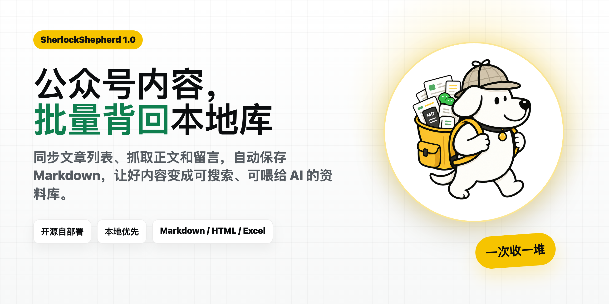
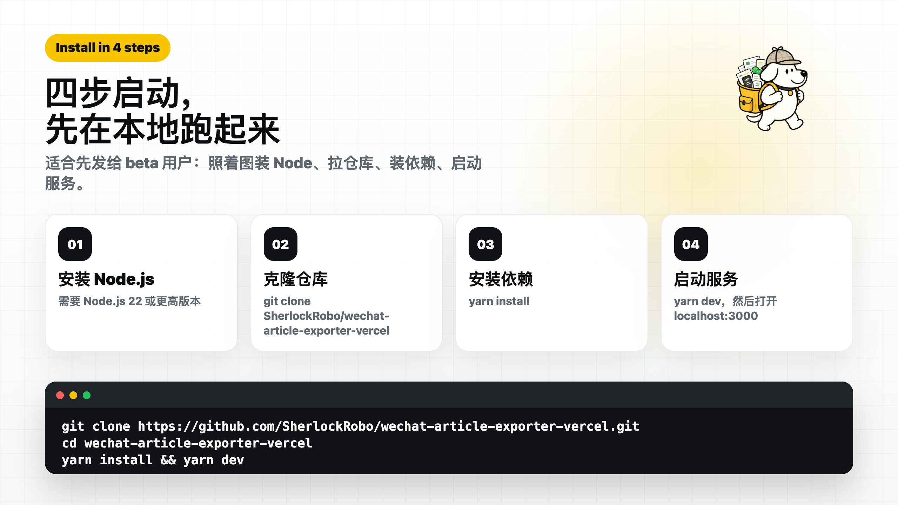
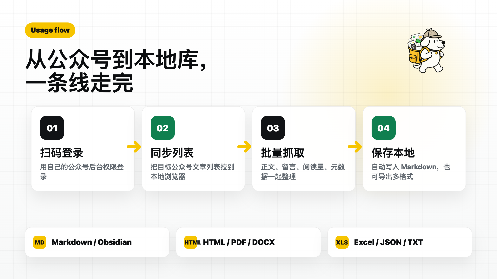
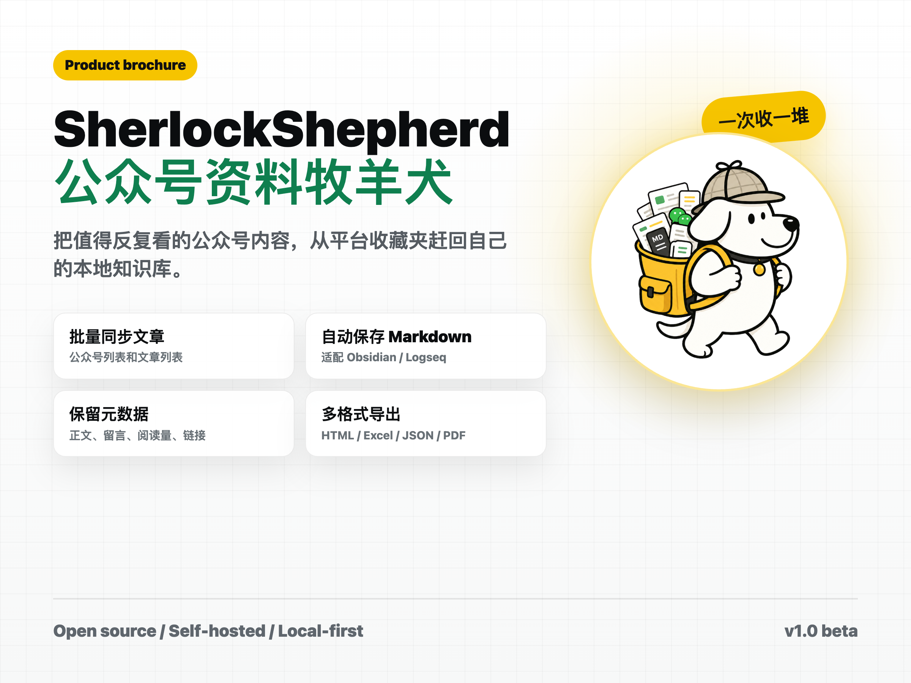

# Sherlocksheperd 1.0

> 公众号内容，一键批量下载到本地知识库。



<p>
  <a href="https://github.com/SherlockRobo/wechat-article-exporter-vercel"></a>
  
  
  
</p>

Sherlocksheperd 是一个可自部署的微信公众号文章导出工具。它可以把自己有权访问的公众号文章列表、正文、留言和元数据整理成本地文件，方便归档到 Obsidian、Logseq、Notion、VS Code 或自己的 Markdown 文件库。

在线体验：https://wechat-article-exporter-drab.vercel.app

## 为什么需要它

微信收藏适合临时收藏，但不适合长期检索、复盘和喂给 AI。Sherlocksheperd 的目标很简单：把值得反复看的公众号内容，从平台收藏夹赶回你自己的本地资料库。

| 你遇到的问题 | Sherlocksheperd 的做法 |
|---|---|
| 收藏很多，后来找不到 | 批量同步文章列表，统一检索 |
| 手动复制正文太慢 | 批量抓取正文、留言和元数据 |
| AI 很难直接读微信收藏 | 自动保存 Markdown，本地可读 |
| 想归档到 Obsidian | 授权 Vault 后自动写入本地目录 |
| 想备份多种格式 | 支持 HTML、Markdown、JSON、Excel、TXT、DOCX、PDF |

## 功能

| 能力 | 说明 |
|---|---|
| 公众号管理 | 搜索、添加公众号，同步文章列表 |
| 批量下载 | 批量抓取文章正文、留言和元数据 |
| 自动保存 Markdown | 授权本地文件夹或 Obsidian Vault 后，抓取成功自动写入本地 |
| 多格式导出 | 支持 HTML、Markdown、JSON、Excel、TXT、DOCX、PDF |
| 抓取记录 | 单独查看正文抓取、阅读量、留言、自动保存和手动导出历史 |
| 本地缓存 | 文章列表和正文缓存保存在浏览器 IndexedDB / LocalStorage |
| Vercel 部署 | 支持 serverless 环境下的登录态保存和同源代理 |
| 合规边界 | 不提供付费文章破解，不使用账号池 |

## 快速开始



需要 Node.js `>=22` 和 Yarn `1.22.x`。

```bash
git clone https://github.com/SherlockRobo/wechat-article-exporter-vercel.git
cd wechat-article-exporter-vercel
yarn install
yarn dev
```

打开：

```text
http://localhost:3000
```

## 使用流程



1. 扫码登录。
2. 在“公众号管理”添加目标公众号并同步文章列表。
3. 在“开始使用”页选择保存策略：勾选自动 Markdown，选择本地文件夹或 Obsidian Vault 根目录。
4. 在“文章下载”选择文章，点击“抓取”下载正文。
5. 抓取成功后，Markdown 自动生成到你授权的本地目录。

默认推荐路径：

```text
clipping/公众号/{account}/{title}.md
```

不用 Obsidian 的用户可以选择普通文件夹，之后用 VS Code、Typora、Notion 导入、飞书文档导入或任意 Markdown 编辑器打开。

## 部署到 Vercel

```bash
yarn build
vercel deploy --prod
```

建议在 Vercel 项目中配置：

```bash
MP_SESSION_SECRET=change_me_to_a_long_random_secret
```

`MP_SESSION_SECRET` 用于加密微信登录态 cookie。生产环境请使用足够长的随机字符串。

## 数据保存在哪里

| 数据 | 保存位置 |
|---|---|
| 文章列表 | 当前浏览器 IndexedDB |
| 正文缓存 | 当前浏览器 IndexedDB |
| 导出配置 | 当前浏览器 LocalStorage / IndexedDB |
| 自动保存目录授权 | 当前浏览器 IndexedDB，只能写入用户手动授权过的目录 |
| 微信登录态 | 加密后写入浏览器 cookie |
| 服务器文章库 | 不保存 |

Vercel 只负责页面托管、接口转发和登录态代理，不维护中心化文章库。换浏览器或清理浏览器数据后，需要重新同步。

## 产品图



## 支持项目

如果这个版本帮到你，可以：

1. 给 GitHub 项目点 Star。
2. 扫描“说明与打赏”页里的公众号二维码，关注后续更新。
3. 使用“说明与打赏”页里的微信打赏码支持维护。
4. 提交 Issue 或 Pull Request。

如果你 fork 后想换成自己的二维码，可以替换：

- `assets/qrcode-official-account.jpg`
- `assets/qrcode-donate.jpg`

## 合规声明

本工具仅用于个人备份、研究和合规归档。通过本工具获取的文章版权归原作者或权利方所有，请勿用于未授权转载、售卖、批量分发或规避平台付费限制。

工具不会把你的公众号账号作为公共账号池给别人使用。你的登录态只服务于你当前浏览器中的操作。

## 致谢

本版本基于开源项目 [wechat-article/wechat-article-exporter](https://github.com/wechat-article/wechat-article-exporter) 调整，保留 MIT License。

## License

MIT
